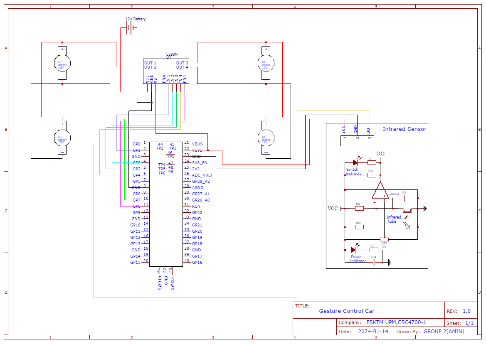

#  Gesture Control Car with Obstacle Detection

This project demonstrates a **gesture-controlled car** using a Raspberry Pi Pico microcontroller and a gyroscopic sensor from a mobile device. Equipped with an infrared sensor for real-time obstacle detection, the car ensures a safe and intuitive driving experience.

---

## 📜 Table of Contents

1. [Introduction](#introduction)
2. [Features](#features)
3. [Components](#components)
4. [Setup and Installation](#setup-and-installation)
5. [Testing](#testing)
6. [Demo](#demo)
7. [Challenges and Future Work](#challenges-and-future-work)
8. [License](#license)

---

## 🚀 Introduction

This project aims to integrate advanced gesture control and obstacle detection into a remote-controlled car. By leveraging the Raspberry Pi Pico and a mobile application's gyroscopic data, the car moves in response to user gestures. An infrared sensor enhances safety by detecting and stopping for obstacles.

---

## ✨ Features

- **Gesture Control**: Operate the car intuitively using your smartphone's gyroscopic sensor.
- **Obstacle Detection**: Infrared sensors ensure the car halts when obstacles are detected.
- **Wireless Communication**: Robust connection between the car and the Android app using HTTP protocols.
- **Interactive Control**: Developed with MIT App Inventor for seamless user interaction.

---

## 🔧 Components

### Hardware
- Raspberry Pi Pico
- Infrared Sensor
- L298N Motor Driver
- 4 DC Motors
- 12V Battery
- Mobile Device with Gyroscope

### Software
- **Arduino IDE**: For programming the Raspberry Pi Pico in C++.
- **MIT App Inventor**: To develop the Android application for gesture-based control.

---

## ⚙️ Setup and Installation

### 1. Hardware Assembly
1. Connect the Raspberry Pi Pico with the L298N motor driver.
2. Attach the infrared sensor for obstacle detection.
3. Power the system using a 12V battery.
4. Connect the DC motors to the motor driver.

### 2. Software Configuration
1. Install the **Arduino IDE** and configure it for Raspberry Pi Pico.
2. Develop the gesture-control application using **MIT App Inventor**.
3. Deploy the web-based interface for HTTP communication.

---

## 🎥 Demo

Watch the project in action: [Gesture Control Car Demo](https://youtu.be/tCSXUghEBDA?si=bh19qniGqKMaNUTh)

